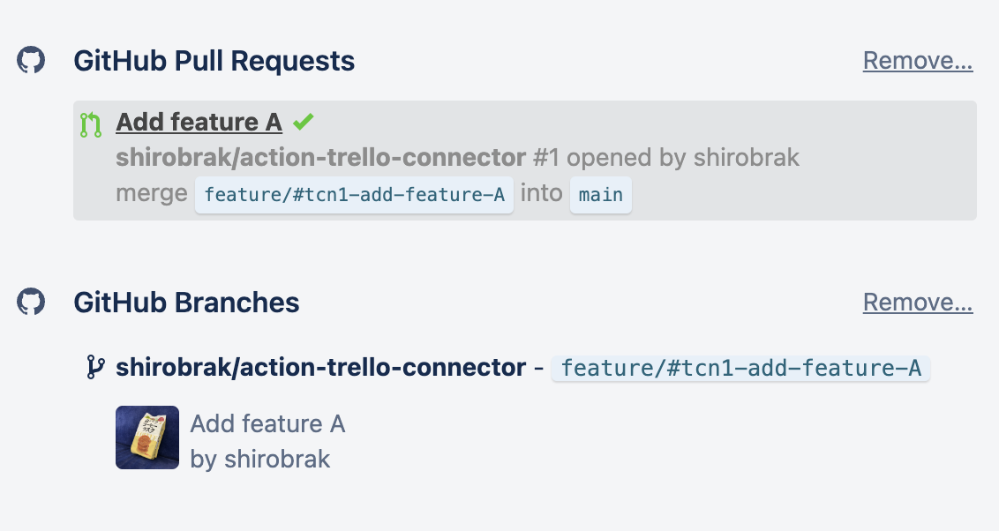

# GitHub Action: Action-Trello-Connector

[](https://github.com/shirobrak/action-trello-connector/actions/workflows/dockerimage.yaml)
[](https://github.com/shirobrak/action-trello-connector/actions/workflows/release.yaml)
[](https://github.com/haya14busa/action-bumpr)

This action provides the integration between GitHub and [Trello](https://trello.com/). <br/>
It is triggered by a Pull Request or Push event and attaches PR and branch information to a Trello Card as an attachment.

## Features

The following features are provided when the PR title, PR body, or branch name contains Trello card number `#tcn${trello_card_number}`, such as `#tcn1234` as an example.

- Attach PR and branch information to Trello Card triggered by Pull Request event
- Attach branch information to Trello Card triggered by Push event




## Inputs

### `github_token`

**Required**. Default is `${{ github.token }}`.

### `trello_api_key`

**Required.**

### `trello_api_token`

**Required.**

### `trello_board_id`

**Required.**

## How to get Trello API key and token

Please refer to the following links for the necessary information on using Trello's API.
[API Introduction](https://developer.atlassian.com/cloud/trello/guides/rest-api/api-introduction/)

## Example usage

```yaml
name: action-trello-connector
on: [push, pull_request]
jobs:
  run-action-trello-connector:
    runs-on: ubuntu-latest
    steps:
      - uses: actions/checkout@v3
      - name: action-trello-connector
        uses: shirobrak/action-trello-connector@v1.0.0
        with:
          github_token: ${{ secrets.GITHUB_TOKEN }}
          trello_api_key: ${{ secrets.TRELLO_KEY }}
          trello_api_token: ${{ secrets.TRELLO_TOKEN }}
          trello_board_id: ${{ secrets.TRELLO_BOARD_ID }}
```